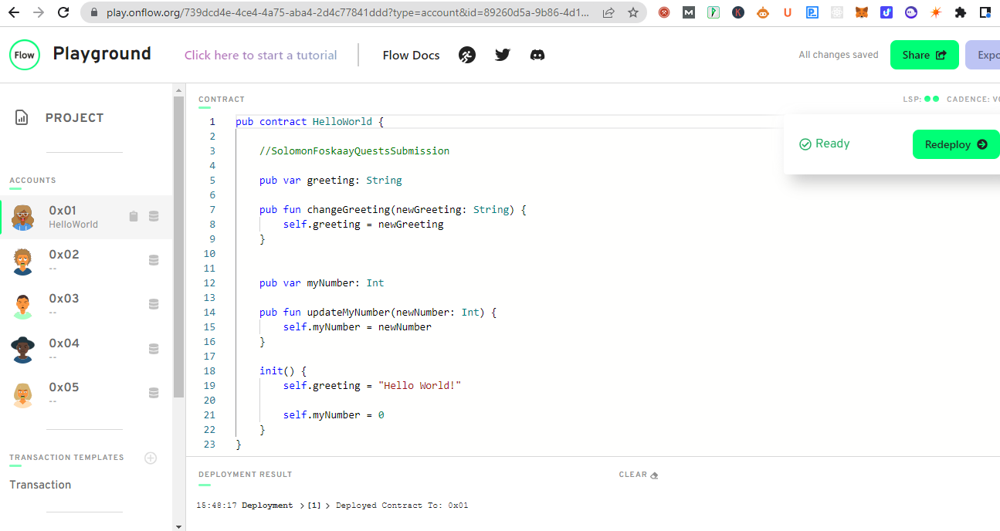

0x08b9666a84ee742e

# ANSWERS TO QUESTS

## CHAPTER 1

### DAY 1
You are free to answer these questions in your own language of choice. And no, I don't mean computer programming language, haha.

#### QUESTION 1: 
Explain what the Blockchain is in your own words. You can read this to help you, but you don't have to: https://www.investopedia.com/terms/b/blockchain.asp
#### ANSWER: 
Blockchain is a decentralized database that allows storage and retrieval of data.

#### QUESTION 2: 
Explain what a Smart Contract is. You can read this to help you, but you don't have to: https://www.ibm.com/topics/smart-contracts
#### ANSWER: 
Smart Contract is a piece of code that run in a Blockchain

#### QUESTION 3: 
Explain the difference between a script and a transaction.
#### ANSWER:
A Script is use to access information from the Blockchain. It's free.
A Transaction involves making changes and storing information into the Blockchain. It's not free and requires paying transaction/gas fees.

-------------------------------------------------

### DAY 2
#### QUESTION 1: 
What are the 5 Cadence Programming Language Pillars?
#### ANSWER: 
Cadence pillars are
1. Security - ensuring smart contract are secure by design (and cheap to deploy on Flow Blockchain too)
2. clarity - easy to read even for non-coder
3. Approachability - seemilar to existing programming languages to make it easier to learn if have experience with any programming language
4. Debug: Easy to debug error
5. Resource Oriented Programming Language

#### QUESTION 2: 
In your opinion, even without knowing anything about the Blockchain or coding, why could the 5 Pillars be useful (you don't have to answer this for #5)?
#### ANSWER: 
The 5 pillars could be very useful to make Flow Blockchain attractive to developers and enhance them to build scalable dApps due to cheap deployment fees.
Low subsequent transaction fees for developers and their users to interact with the smart contract after deployment will aid mass adoption of the Blockchain and web3 as a whole

====================================================
====================================================

## CHAPTER 2

### DAY 1
For todays quest, please load up a new Flow playground by going to https://play.onflow.org just like we did in this lesson. You will use that for writing your code.

#### QUESTION 1: 
Deploy a contract to account 0x03 called "JacobTucker". Inside that contract, declare a constant variable named is, and make it have type String. Initialize it to "the best" when your contract gets deployed
#### ANSWER: 

#### QUESTION 2: 
Check that your variable is actually equals "the best" by executing a script to read that variable. Include a screenshot of the output.
#### ANSWER: 

-------------------------------------------------

### DAY 2
Please answer in the language of your choice.

#### QUESTION 1: 
Explain why we wouldn't call changeGreeting in a script.
#### ANSWER: 
We couldn't call changeGreeting in a script because it requires changing data (the value of variable "greeting" in our smart contract) on the Blockchain and cost gas. That is only done via "Transaction" not "Script".
Script can only view existing data as is on the Blockchain.

#### QUESTION 2: 
What does the AuthAccount mean in the prepare phase of the transaction?
#### ANSWER: 
In the "prepare" phase of the transaction, AuthAccount means account of the signer that has been granted access to execute transactions and sign it.

#### QUESTION 3: 
What is the difference between the prepare phase and the execute phase in the transaction?
#### ANSWER: 
The "prepare" phase get needed access to the user account, which are essential to be used in the "Execution" phase (where the actual transaction is initiated and executed).

#### QUESTION 4: 
This is the hardest quest so far, so if it takes you some time, do not worry! I can help you in the Discord if you have questions.
Add two new things inside your contract:
A variable named myNumber that has type Int (set it to 0 when the contract is deployed)
A function named updateMyNumber that takes in a new number named newNumber as a parameter that has type Int and updates myNumber to be newNumber
Add a script that reads myNumber from the contract
Add a transaction that takes in a parameter named myNewNumber and passes it into the updateMyNumber function. Verify that your number changed by running the script again.
#### ANSWER: 
(4a) A variable named myNumber that has type Int (set it to 0 when the contract is deployed)
(4b) function named updateMyNumber that takes in a new number named newNumber as a parameter that has type Int and updates myNumber to be newNumber

(4c) Add a script that reads myNumber from the contract

(4d) Add a transaction that takes in a parameter named myNewNumber and passes it into the updateMyNumber function. Verify that your number changed by running the script again.

Final result of script rerun after transaction execution to update "myNumber" variable value from "0" to "1234567890" in the smart contract

-------------------------------------------------

### DAY 3
Please answer in the language of your choice.

#### QUESTION 1: 
In a script, initialize an array (that has length == 3) of your favourite people, represented as Strings, and log it.
#### ANSWER: 

#### QUESTION 2: 
In a script, initialize a dictionary that maps the Strings Facebook, Instagram, Twitter, YouTube, Reddit, and LinkedIn to a UInt64 that represents the order in which you use them from most to least. For example, YouTube --> 1, Reddit --> 2, etc. If you've never used one before, map it to 0!
#### ANSWER:

#### QUESTION 3: 
Explain what the force unwrap operator ! does, with an example different from the one I showed you (you can just change the type).
#### ANSWER: 
Force unwrap "!" is an operator used to unwrap variable value to display the content. But, if the value is "nil", then it helps to terminate the program instantly. If it finds valid variable value, then it removes the optional type to give out a valid variable value type (especially useful in Dictionary where the value are always "optional" because it can either hold a value like 1, "one" or nil).

Example:

#### QUESTION 4: 
Using this picture below, explain...
What the error message means
Why we're getting this error
How to fix it

#### ANSWERS BELOW: 

(4a) What the error message means
#### ANSWER:

(4b) Why we're getting this error
#### ANSWER:

(4c) How to fix it
#### ANSWER:

